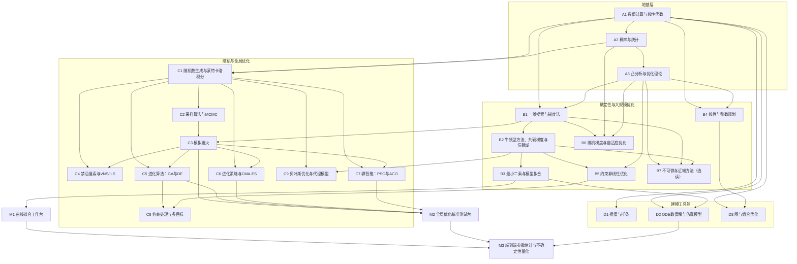

# 数学建模与参数优化理论知识路线图

> 主线：参数优化方法（蒙特卡洛、模拟退火、粒子群等），配数学建模的工具箱支撑。
> 四层结构：地基层（A）→ 确定性与大规模优化（B）→ 随机与全局优化（C）→ 建模工具箱（D）。
> 全部核心算法自实现，零第三方依赖；随机数生成器、基准函数测试台、统计检验工具等基础设施随章节自生长，供后续章节复用。

## 总览依赖图

---

# 地基层（A）

## A1 数值计算与线性代数

**定位**：全路线的工程地基。浮点误差理论、矩阵运算、线性方程组求解、数值微积分——后续每一章的矩阵操作与误差分析都从这里产出并自生长为路线基础库（向量/矩阵运算、LU、Cholesky 求解器）。

**知识点清单**：
- 浮点表示、机器精度、舍入误差；病态问题与条件数
- 向量/矩阵运算、范数；存储布局对性能的影响（实验尺寸小，性能非重点）
- 高斯消元、部分主元 LU 分解；Cholesky 分解（对称正定，供 C9 高斯过程复用）
- 迭代法：Jacobi、Gauss-Seidel、SOR
- 数值微分：前向/中心差分，截断误差与舍入误差的权衡（最优步长存在性）
- 数值积分：复化梯形、复化 Simpson、收敛阶

**编码实验**：
1. 实现带部分主元的 LU 分解，对随机生成的可控条件数合成矩阵验证残差
2. 三种差分格式对同一光滑函数求导，对步长画误差曲线，实测"误差 U 形曲线"与最优步长
3. 复化 Simpson 积分，log-log 坐标回归实测收敛阶
4. Cholesky 分解（基础设施，供 C9）

**客观过关判据**：
- LU 求解残差 ‖Ax−b‖/‖b‖ < 1e-12 × 条件数（双精度）
- 数值微分误差曲线呈 U 形，实测最优步长与理论 √ε 量级相符（比值落在 [0.3, 3]）
- Simpson 实测收敛阶（log-log 回归斜率）= 4 ± 0.3

**材料映射**：Nocedal & Wright《Numerical Optimization》附录矩阵分析（主干）；Press《Numerical Recipes》数值微分/积分章（参考）
**依赖章**：无

## A2 概率与统计

**定位**：C 层随机算法的理论源头，同时产出路线的"判据工具箱"——后续所有采样类算法的过关判据（KS 检验、卡方检验）在本章自实现，A2 的检验工具是全路线统计口径的裁判。

**知识点清单**：
- 常见分布（均匀/指数/正态/泊松）及其矩；CDF/PDF/分位数函数
- 大数定律、中心极限定理（蒙特卡洛收敛性的理论根基）
- 估计量与置信区间；最大似然估计（与 B3 最小二乘在正态噪声下等价——伏笔）
- 假设检验逻辑：原假设、显著性、p 值、两类错误
- KS 检验（分布拟合判据）、卡方拟合优度检验
- 方差缩减：对偶变量、公共随机数、分层采样、控制变量法

**编码实验**：
1. 验证 CLT：固定分布抽样取均值，重复实验画均值分布直方图（文本统计），与正态对比卡方检验
2. 自实现 KS 检验（含临界值查表），对已知分布样本做拟合检验
3. 控制变量法估计已知解析值的积分，实测方差缩减比并与理论推导对照

**客观过关判据**：
- 自实现 KS 检验在 1000 次重复实验中对符合原假设的样本拒绝率落在 [0.03, 0.07]（α=0.05 标称）
- 控制变量法方差缩减比与理论公式值相对误差 < 10%

**材料映射**：Ross《A First Course in Probability》（地图，选读深化）；Rubinstein & Kroese《Simulation and the Monte Carlo Method》第 1–2 章（主干）
**依赖章**：A1

## A3 凸分析与优化理论

**定位**：理论地图章（少实现、多推导）。定义全路线语言：凸性、最优性条件、收敛率；论证 B 层局部方法的能力边界与非凸问题必须依赖 C 层全局方法的理论必然性。

**知识点清单**：
- 凸集、凸函数、一阶/二阶刻划；强凸性与条件数
- 局部最优/全局最优；凸问题"局部即全局"定理
- 梯度/Hessian；一阶必要条件、二阶充分条件
- Lagrange 乘数法、对偶问题、KKT 条件（弱对偶/强对偶成立条件）
- 收敛率定义：线性/次线性/超线性/二次收敛（B 层实验的度量语言）
- 无免费午餐定理（C 层"没有万能算法"的理论依据）

**编码实验**：
1. 强凸二次函数上最速下降的收敛因子实测，与理论公式 (κ−1)/(κ+1) 对照（κ 为条件数）
2. 构造双谷非凸函数：网格粗扫 + 多起点局部法，统计落入各局部极小的比例（全局方法存在性的实证）
3. 简单 QP 的 KKT 条件数值验证（乘子恢复）

**客观过关判据**：
- 最速下降实测收敛因子与理论值相对误差 < 20%（至少三个不同 κ）
- 多起点实验：局部方法命中全局最优的比例 < 100% 且随起点分布可复现（非凸性实证）

**材料映射**：Boyd & Vandenberghe《Convex Optimization》第 1–5 章（地图）；Nocedal & Wright 第 1–2 章（主干）
**依赖章**：A1

---

# 确定性优化（B）

## B1 一维搜索与梯度法

**定位**：优化的第一动作章。建立"下降方向 + 线搜索"标准工作流；最速下降的锯齿病理直接论证二阶信息的必要性（通向 B2）与条件数敏感性的直觉（通向 C 层全局方法）。

**知识点清单**：
- 单峰性、区间套定理；黄金分割搜索；成功抛物线插值
- 下降方向、充分下降；Armijo 回退线搜索；Wolfe 条件
- 最速下降法；锯齿现象与病态条件数的定量关系
- 步长准则实现细节（初始步长、c1/c2 参数的常用取值）

**编码实验**：
1. 黄金分割搜索求一维抛物线最小，实测每步区间收缩比 ≈ 0.618
2. Armijo 回退线搜索：统计不同 c1 下试探步数，理解接受准则松紧的影响
3. 最速下降解病态二次问题：迭代轨迹数据落盘（可复现锯齿），对比良态问题迭代数

**客观过关判据**：
- 黄金分割实测收缩比与 0.618 相对误差 < 1%
- 病态/良态问题迭代数之比与条件数理论预测同数量级

**材料映射**：Nocedal & Wright 第 3 章（主干）
**依赖章**：A1 A3

## B2 牛顿型方法、共轭梯度与信赖域

**定位**：快速局部方法——路线的"局部精修引擎"。M2 混合架构的局部阶段、C9 贝叶斯优化的内层求解都复用本章产出；收敛阶实测是把理论判据落地的样板章。无导数方法（Nelder-Mead 等）一并收录：目标函数不可求梯度时（黑箱/带噪声仿真）的确定性兜底方案。

**知识点清单**：
- 牛顿法及二次收敛；Hessian 非正定的修正（正定化处理）
- 拟牛顿思想：割线方程；DFP/BFGS 更新公式（手推一次）；L-BFGS 有限内存版
- 线搜索 vs 信赖域两大框架：信赖域子问题、Dogleg 路径、半径更新策略（与 B3 的 LM 阻尼呼应）
- 共轭方向法、线性共轭梯度（CG）；有限步终止性质
- 坐标下降（与 C 层坐标级邻域搜索的联系）
- 无导数优化：Nelder-Mead 单纯形法（反射/扩张/收缩操作、退化陷阱）；模式搜索（Hooke-Jeeves）；DIRECT（注记：确定性全局划分采样）
- 不可微目标的次梯度法思想（深水区在 B7 展开）

**编码实验**：
1. 牛顿法解 Rosenbrock 函数（香蕉谷经典试金石），统计到机器精度的迭代数与收敛阶
2. BFGS vs 最速下降同题对比：迭代数、函数评估数（收敛数据落盘）
3. CG 解 n 维二次问题：验证有限步终止（≤ n 步达高精度）
4. 收敛阶测量：残差比序列估计收敛阶，验证牛顿 ≈ 2、BFGS 超线性
5. 信赖域 vs 线搜索框架：同问题同预算下的函数评估数与鲁棒性（病态起点）对比
6. Nelder-Mead 解 Rosenbrock 与带仿真噪声的目标（噪声下梯度法失效的场景），实测其韧性

**客观过关判据**：
- CG 在 n 维二次问题上 ≤ n 步内残差 < 1e-10
- 实测收敛阶：牛顿法 2 ± 0.3；BFGS > 1.2（超线性证据）
- Rosenbrock 上 BFGS 函数评估数显著少于最速下降（差距 ≥ 5 倍）
- 信赖域方法在病态起点集合上的失败率（未达精度）低于纯线搜索方案，且差异跨 ≥ 10 个测试起点可复现
- 加性噪声场景（噪声幅度已知）：Nelder-Mead 终值误差 ≤ 噪声幅度 3 倍，梯度法同条件发散或显著劣化（对照实证）

**材料映射**：Nocedal & Wright 第 4–7、9 章（主干，第 9 章即无导数方法）；Nelder & Mead 1965（一手文献）；Press《Numerical Recipes》最优化章（参考）
**依赖章**：B1 A1

## B3 最小二乘与模型拟合

**定位**：数学建模"从数据反推参数"的主食章。M1 曲线拟合工作台的主引擎（Gauss-Newton/LM）；与 A2 的 MLE 伏笔在此闭合（正态噪声下 MLE = LS），置信区间实验是统计口径纪律的样板。

**知识点清单**：
- 线性最小二乘：正规方程 vs QR 分解（数值稳定性差异）；法方程条件数平方放大
- 统计解释：正态噪声下 LS = MLE；参数协方差 ≈ σ²(XᵀX)⁻¹；置信区间
- 非线性最小二乘：Gauss-Newton；Levenberg-Marquardt（阻尼/信赖域思想）
- 加权最小二乘、鲁棒损失（Huber）；残差诊断

**编码实验**：
1. 线性 LS 拟合合成数据（已知真参数 + 已知噪声方差），参数恢复误差与 3σ 判据
2. QR vs 正规方程：病态设计矩阵上解的相对误差对比（实测稳定性差异）
3. LM 拟合非线性模型（指数衰减 + 正弦叠加），初始值扫描：收敛域实测
4. 参数置信区间覆盖率实验：500 次重复，名义 95% CI 实测覆盖率

**客观过关判据**：
- 参数恢复误差全部落在 3σ 内
- 95% CI 实测覆盖率落在 [88%, 99%]（500 次重复，名义 95%）
- LM 在给定初值邻域内（该邻域经扫描确定并记录）收敛成功率 = 100%

**材料映射**：Nocedal & Wright 第 10 章（主干）；Press《Numerical Recipes》建模数据拟合章（参考）
**依赖章**：B2 A2

## B4 线性与整数规划

**定位**：运筹学基座，数学建模中成熟度最高、求解最可靠的分支。自实现单纯形 + 对偶理论；分支定界扩展到整数规划（建模竞赛高频）。

**知识点清单**：
- LP 标准形、基可行解与顶点的等价性；单纯形法（修订版；Bland 规则防循环）
- 两阶段法/大 M 法；退化与循环
- 对偶理论：弱/强对偶、互补松弛；影子价格与灵敏度分析
- 整数规划：分支定界（LP 松弛上界 + 割）；割平面、分支切割概览（地图）

**编码实验**：
1. 自实现单纯形解小规模 LP（n ≤ 10）：与顶点枚举法（全枚举基变量组合）互验
2. 对偶解读影子价格，数值验证互补松弛条件
3. 分支定界解小规模背包/指派问题，与暴力枚举在 100 个随机实例上对账

**客观过关判据**：
- 原始-对偶目标间隙 = 0（双精度直接比较）
- 分支定界与暴力枚举 100/100 实例解一致

**材料映射**：Hillier & Lieberman《Introduction to Operations Research》LP 章节群（地图，配合主干）；Chvátal《Linear Programming》（选读深化）
**依赖章**：A1 A3

## B5 约束非线性优化

**定位**：B 层的收口——一般约束问题的通用解法；同时为 C 层准备"约束处理"的公共语言（罚函数是两层共享的核心机制，C8 的 EA 约束处理直接对照本章）。

**知识点清单**：
- 外点罚函数法：收敛性与罚系数增大导致的病态化（理论+实测）
- 内点法/障碍函数；原始-对偶内点法概览（地图）
- 增广拉格朗日法：为何优于纯罚（病态问题消解）
- 投影梯度法（箱式/线性约束）；序列二次规划 SQP 概览（地图）

**编码实验**：
1. 外点罚函数法：罚系数对数扫描（1→10⁶），实测解精度提升与问题病态化的双刃剑
2. 增广拉格朗日法解同一问题：达到相同精度所需罚量级的对比（优势量化）
3. 投影梯度解箱式约束问题，与有效集枚举互验

**客观过关判据**：
- 增广拉格朗日达到与纯罚相同解精度所需罚系数 ≤ 纯罚方案的 1%
- 最终解 KKT 残差 < 1e-6；投影梯度与有效集枚举解一致（100 个随机箱式问题）

**材料映射**：Nocedal & Wright 第 16–18 章（主干）；Boyd《Convex Optimization》第 10–11 章（地图）
**依赖章**：B2 A3

## B6 随机梯度与自适应优化

**定位**：大规模数据场景下的参数优化范式——目标函数是全部数据期望时，精确梯度反而昂贵，随机小批量梯度才是第一现场。深度学习训练的全部优化器谱系（SGD/动量/Adam 等）的理论故乡；对研究"训练动力学"是地基章。

**知识点清单**：
- 随机近似框架：Robbins-Monro 迭代（1951）；步长条件（∑αₖ=∞, ∑αₖ²<∞）
- 期望损失 vs 经验损失；梯度估计方差与批量大小
- 凸目标 SGD 收敛率 O(1/√k)；强凸加速版；与全批梯度下降的收敛率对照
- 动量：Polyak 重球法；Nesterov 加速梯度（凸问题加速率 O(1/k²) 的构造思想）
- 自适应学习率谱系：AdaGrad（理论动机：频率平衡）→ RMSProp → Adam → AdamW（解耦权重衰减）；各更新公式逐项推导与差异归因
- 学习率调度：阶梯/余弦/预热；warmup 的必要性经验
- 方差缩减概览（地图）：SVRG、SAGA
- 延伸：随机优化的泛化视角（SGD 隐式正则化，注记级）

**编码实验**：
1. 合成凸问题（线性回归/逻辑回归）上 SGD vs 全批梯度下降：同计算预算的次优性差距曲线
2. 步长序列实验：固定步长 / 递减步长 ∝ 1/k / ∝ 1/√k 三方案收敛对比，验证递减条件的必要性
3. 动量与 Nesterov 加速：实测收敛曲线对比（凸二次问题验证 O(1/k²) 加速段）
4. Adam vs SGD 动量：同一非凸小问题（如小型网络或非凸基准）训练轨迹对比；学习率×调度网格热图（PGM）

**客观过关判据**：
- 递减步长下 SGD 实测次优差距衰减斜率与 O(1/√k) 理论一致（log-log 回归斜率 −0.5 ± 0.1）
- Nesterov 版在凸二次问题上迭代数显著少于普通动量版（同精度同判据，p < 0.01）
- Adam 对步长的鲁棒区间显著宽于 SGD（网格扫描的成功步长范围比，实测记录）
- 复现"scaled 不变性"：目标函数纵向缩放 c 倍，AdaGrad/Adam 轨迹几乎不变而 SGD 显著改变（定量对照）

**材料映射**：Bottou, Curtis & Neshat《Optimization Methods for Large-Scale Machine Learning》（选读深化）；Robbins & Monro 1951（一手源头）；Nesterov《Introductory Lectures on Convex Optimization》（主干·加速理论）；Kingma & Ba 2014（Adam 一手）；Ruder 2016 综述（地图）
**依赖章**：B1 A2 A3

## B7 不可微与近端方法（选读）

**定位**：目标函数含 |·|/max/约束指示函数时的现代标准解法。稀疏建模（LASSO）、图像重建、分布式优化的算法支柱；与 B6 合看构成"现代大规模优化"图景。

**知识点清单**：
- 次梯度与次微分；次梯度法的收敛率（慢：O(1/√k)）与病态直觉
- 近端算子：prox 定义、近端点法
- 软阈值算子 = L1 项的 prox（手推）；ISTA 算法；FISTA 加速版
- ADMM：分裂思想、增广拉格朗日连接（B5 伏笔回收）、收敛性陈述；缩放形式实现
- 应用模板：LASSO（ISTA/FISTA）、基追踪、一致优化问题分治

**编码实验**：
1. 次梯度法 vs ISTA 解 LASSO 合成实例：同预算解的次优性差距与稀疏恢复对比
2. FISTA vs ISTA 收敛加速实测（目标值下降曲线）
3. ADMM 解带约束 QP，与 B5 增广拉格朗日同题对账（解一致性与迭代数）

**客观过关判据**：
- LASSO 合成实例（真稀疏支持已知）：ISTA 零分量恢复支持准确率 ≥ 90%
- FISTA 达到 ISTA 同精度所需迭代数 ≤ ISTA 的 1/2
- ADMM 与增广拉格朗日终解目标值相对差 < 1e-8

**材料映射**：Parikh & Boyd《Proximal Algorithms》（主干，专著）；Boyd et al. 2011《Distributed Optimization and Statistical Learning via ADMM》（一手/主干）；Beck & Teboulle 2009 FISTA（一手）
**依赖章**：A3 B1 B2

---

# 随机与全局优化（C）——本路线重点层

## C1 随机数生成与蒙特卡洛积分

**定位**：C 层的机务室。自实现均匀随机数发生器（全路线随机性的唯一源头），任意分布采样算法，蒙特卡洛积分及其 O(1/√N) 收敛理论——维数无关性正是 MC 对抗维数灾难的立身之本。

**知识点清单**：
- 线性同余发生器 LCG（数论性质、谱检验概念）；xorshift；Mersenne Twister（选一种深实现，其余理解原理）
- 发生器质量测试：均匀性（卡方）、序列独立性（自相关）、间隔检验——复用 A2 工具箱
- 逆变换采样（含离散分布）；拒绝采样（包络常数 c、接受率理论 1/c）
- 正态采样：Box-Muller、Marsaglia 极法
- MC 积分：期望估计视角；误差 O(1/√N) 与维数无关性；维数灾难的定量对比（网格法 vs MC）
- 重要性采样：方差最小化推导；权重方差与坏比值的诊断
- 拟随机序列 Sobol（注记：低差异序列 vs 伪随机的收敛阶差异，读图即可）

**编码实验**：
1. 自实现一种发生器 + Box-Muller，全套质量测试（均匀性/独立性/各阶矩）
2. 逆变换采样指数/正态分布 → KS 检验过关
3. 拒绝采样截断正态：实测接受率 vs 理论 1/c
4. MC 积分算 π 与高斯积分：log-log 回归实测斜率 −0.5；重要性采样 vs 朴素 MC 的方差比

**客观过关判据**：
- 发生器通过卡方均匀性（拒绝率在理论区间）与滞后自相关检验（|ρ| < 2/√N）
- KS 检验拒绝率落在 [0.03, 0.07]（1000 次重复，α=0.05）
- MC 积分实测收敛斜率 −0.5 ± 0.05
- 拒绝采样接受率与理论值相对误差 < 2%

**材料映射**：Rubinstein & Kroese《Simulation and the Monte Carlo Method》第 3–5 章（主干）；Press《Numerical Recipes》随机数章（参考）
**依赖章**：A2 A1

## C2 采样算法与 MCMC

**定位**：蒙特卡洛的皇冠章——从"无法归一化"的分布采样。Metropolis 核是本章主角，同时是 C3 模拟退火的概率论祖先（两章共享接受-拒绝原语，基础设施自生长的样板）；后验采样引擎供 M3 不确定性量化直接复用。

**知识点清单**：
- 归一化常数之痛：为什么直接采样失败、拒绝采样失效（高维包络崩塌）
- Metropolis 算法（1953）；Metropolis-Hastings 推广（非对称提议的修正系数推导）
- 细致平衡、不可约性、遍历性（马尔可夫链收敛定理，陈述+直觉）
- burn-in、thin、链诊断：自相关时间、Gelman-Rubin R̂ 多链判据
- Gibbs 采样（条件分布轮转；二元正态/共轭模型实战）
- Hamiltonian Monte Carlo（注记：梯度引导提议为何在高维高效，地图级理解）

**编码实验**：
1. MH 采样二维独立高斯（解析后验已知）：均值/协方差与解析值对账
2. 相关系数 0.95 的强相关高斯：实测自相关时间，验证 thin 的必要性
3. Gibbs 采样二元共轭正态模型，与解析后验对账；同题对比 MH 的自相关时间
4. Gelman-Rubin 诊断：4 链并行实验，R̂ 收敛过程落盘

**客观过关判据**：
- 2D 高斯采样均值误差 < 3 个标准误；协方差元素相对误差 < 10%
- Gibbs 自相关时间显著短于随机游走 MH（同目标分布，比值 < 1/3）
- burn-in 后 R̂ < 1.1 且持续满足（4 链）

**材料映射**：Rubinstein & Kroese 第 6 章（主干）；Metropolis et al. 1953、Hastings 1970（一手文献）
**依赖章**：C1 A2

## C3 模拟退火

**定位**：指定重点方法之一。MC 思想用于优化的鼻祖——"带降温调度的 MCMC"；从 MCMC 视角解释其收敛保证（慢降温→全局最优概率→1）与实用降温（快但失保证）的取舍；M2 测试台第一支柱。

**知识点清单**：
- Metropolis 准则用于目标函数；温度参数的物理来源与数学角色
- 温度调度：几何降温（实用标配）、经典对数降温（理论收敛保证但不可用地慢）、自适应调度概览
- 邻域函数设计：连续问题（高斯扰动幅度×温度联动）与组合问题（交换/2-opt）各自的设计逻辑
- 初始温度标定（目标接受率反推法）；接受率曲线监控诊断
- 重加热与多重启；SA 与局部搜索的关系（温度→0 退化为贪心）

**编码实验**：
1. SA 解 2D Rastrigin（约 50 个局部极小）：1000 次独立运行统计全局最优命中率
2. 单变量参数扫描：降温系数、内循环步数、初始温度逐个扫 → 命中率/平均迭代数热图（PGM 灰度落盘）
3. 小规模 TSP：swap 邻域 vs 2-opt 邻域 SA 对比（同预算）
4. 接受率-温度曲线诊断：实测接受率随温度衰减轨迹，标定"有效降温窗口"

**客观过关判据**：
- 调参后 1000 次运行全局最优命中率 ≥ 80%（2D Rastrigin，记录最终参数组）
- 参数敏感性热图完整覆盖扫描网格且可复算（同参数复跑命中率波动 < ±5 个百分点）
- 2-opt 邻域最终回路长度显著优于 swap 邻域（配对检验 p < 0.01）

**材料映射**：Kirkpatrick, Gelatt & Vecchi 1983《Optimization by Simulated Annealing》（一手文献，精读）；Aarts & Lenstra《Local Search in Combinatorial Optimization》（选读深化）
**依赖章**：C2 C1 B1

## C4 禁忌搜索与变邻域/迭代局部搜索

**定位**：单解元启发式的"系统化"一支——SA 用概率接受准则逃离局部最优，本族用**记忆（禁忌表）与邻域系统化**做到同一件事。组合优化实战（调度/路径/指派）的主力军；与 C3 合看构成"单解法族"完整谱系，为 M2 提供组合侧算法选型。

**知识点清单**：
- 禁忌搜索（Tabu Search, Glover 1986）：禁忌表、禁忌任期、特赦准则（aspiration）；短期记忆 vs 长期记忆（频次/强度）
- 邻域移动的系统性设计：best-improvement vs first-improvement 的取舍
- 变邻域搜索（VNS）：邻域结构族、系统化震颤（shaking）+ 局部搜索交替；变邻域下降 VND
- 迭代局部搜索（ILS）：扰动 + 局部最优回溯的极简框架；扰动强度的单变量角色
- 大规模邻域搜索（LNS，注记）：毁灭-重建框架（运筹求解器内置的主流范式）
- GRASP（注记：贪心随机自适应 + 局部搜索）
- 三框架与 SA 的同构对照：逃离局部最优的四种机制（概率接受/禁忌/邻域切换/扰动）

**编码实验**：
1. 禁忌搜索解小规模 TSP / 车间调度基准：禁忌表长度单变量扫描 → 解质量曲线
2. VNS 邻域族设计实验：单邻域 vs 多邻域族（VND）同预算对比
3. ILS 扰动强度扫描：过弱（回原地）/过强（退化为随机重启）的 U 形曲线实测
4. 四机制横向对账：SA / TS / VNS / ILS 同一组合问题同预算对比（M2 组合侧预演）

**客观过关判据**：
- 禁忌表长度存在可复现的最优区间（两侧劣化均显著，U 形证据）
- 多邻域族 VNS 显著优于任一单邻域版本（配对检验 p < 0.01）
- ILS 扰动强度-解质量曲线呈 U 形且最优区间可复现
- 四机制对账表完整（同预算同实例 ≥ 100 次运行），各自最优场景可归因（如 TS 长跑、SA 快降温等定性差异落到数据）

**材料映射**：Glover 1986/1989《Future Paths for Integer Programming... / Tabu Search》（一手文献，精读）；Mladenović & Hansen 1997（VNS 一手）；Lourenço, Martin & Stützle 2003（ILS 手册章）；Pisinger & Ropke 2010（LNS 选读）
**依赖章**：C3 C1

## C5 进化算法：遗传算法与差分进化

**定位**：种群法双引擎。GA 是离散/组合问题的通用劳模；DE 是连续参数优化实战前三的强者（与 PSO 同级，C7 对照）；两算法是 M2 测试台的人口支柱。参数敏感性扫描是本章实验灵魂——把"算法调参 folklore"变成自己实测出的参数表。

**知识点清单**：
- GA：编码（二进制/实数/排列）、适应度标定、选择（轮盘/锦标赛/排名）、交叉（单点/均匀/算术）、变异、精英保留
- 模式定理与积木块假设（理论地图：理解 GA 为何与为何不工作）
- DE：差分变异 DE/x/y/z 记号体系；缩放因子 F、交叉率 CR；变体家族 rand/1、best/1、current-to-best/1；自适应 DE（jDE/SaDE 概览）
- EDA（估计分布算法，注记）：从算子进化到分布进化的谱系跃迁
- 跨熵方法（CE，注记）：与 C1 同源的概率视角全局优化
- Memetic 算法（注记）：GA + 局部精修——正是 M2 混合架构的学术名
- 种群多样性度量；早熟收敛的定量诊断
- 参数交互效应：F×CR 联合扫描（单变量纪律的对照实验——交互项是否存在）

**编码实验**：
1. GA 二进制编码解 OneMax → 换接解耦函数（deceptive function），实测早熟发生
2. DE 在 Rosenbrock/Rastrigin 上的变体对比：rand/1 vs best/1（单峰/多峰各测）
3. F、CR 网格扫描：成功率热图（PGM），产出自己的最小参数表
4. 种群多样性曲线诊断：早熟 vs 正常收敛的多样性轨迹对比

**客观过关判据**：
- F∈{0.2,…,1.0}×CR∈{0,…,1} 网格上 10 维 Rastrigin 成功率全表落盘（每格 ≥ 50 次运行）
- rand/1 与 best/1 在单峰/多峰问题上优势相反（配对检验 p < 0.01）——与文献定性结论对账
- 早熟案例的种群多样性跌落时刻早于成功案例（中位数对比，差异显著）

**材料映射**：Eiben & Smith《Introduction to Evolutionary Computing》（主干）；Storn & Price 1997《Differential Evolution》（一手文献精读）；Goldberg《Genetic Algorithms in Search, Optimization and Machine Learning》（选读深化）
**依赖章**：C1 C3

## C6 进化策略与 CMA-ES

**定位**：进化计算的另一嫡系（德国 ES 派 vs 美国 GA 派）——连续优化上理论最扎实、实战排名顶尖的自适应算法族。CMA-ES 是无导数连续优化的当前最强基线之一（超参调优社区标配），其协方差自适应机制是"算法自己学出问题结构"的典范；M2 测试台连续侧的第五号选手（扩展接口）。

**知识点清单**：
- 进化策略记法：(μ/ρ, λ)-ES 与 (μ/ρ + λ)-ES（comma vs plus 选择压力）
- 1/5 成功规则（Rechenberg）：步长自适应的开山思想
- σ 自适应：自适应步长的谱系（成功规则 → 自适应矩估计类比 B6 的 Adam——跨族同构）
- CMA-ES 核心：协方差矩阵自适应（分布形状逐步学出问题的等高线结构）、进化路径（累积步信息）、主成分更新；秩-μ 更新
- RESTARS/IPOP 重启策略与预算分配（注记）
- 与 DE/PSO 的机制对照：DE 变异是"个体差分"，CMA 是"分布学习"——两种归纳偏置

**编码实验**：
1. 简单 (1+1)-ES + 1/5 成功规则解球面函数：步长轨迹与成功率的自适应行为实测
2. CMA-ES（核心简化版）vs DE vs PSO：Rosenbrock/Rastrigin 同预算对账（M2 预演）
3. 协方差矩阵可视化：迭代若干代后 C 的特征向量/特征值 vs 目标函数等高线主轴的对齐过程（PGM 落盘）

**客观过关判据**：
- 1/5 成功规则使成功率达到目标区间 0.2 ± 0.05（自适应收敛实证）
- CMA-ES 在 Rosenbrock（强弯曲谷）上的函数评估数显著优于 DE（配对检验 p < 0.01），在 Rastrigin 上优势缩窄或反转（机制归因落到数据）
- 协方差主轴与函数等高线主轴夹角随迭代单调收敛（对齐过程可复现）

**材料映射**：Hansen 2016《The CMA Evolution Strategy: A Tutorial》（一手/主干，精读）；Bäck & Schwefel 1993（ES 谱系一手综述）；Auger & Hansen 重启理论（选读）
**依赖章**：C1 C3

## C7 群智能：粒子群与蚁群

**定位**：指定重点方法之一。PSO 是连续优化与 DE 并列的工业标准；ACO 是组合优化（TSP/路由/调度）主力。拓扑与消融实验是本章特色——把算法行为归因到每个分量。

**知识点清单**：
- PSO 速度-位置更新方程：惯性项/认知项/社会项三分量
- 惯性权重 w（Shi-Eberhart 线性递减策略）vs 收缩因子 φ（Clerc 理论构造）两大学派
- 邻域拓扑：全局星型 vs 环型 vs Von Neumann；收敛速度-鲁棒性权衡
- 速度钳制、边界处理（吸收/反射/随机重置）；早熟与多样性
- 消融分析：认知-only、社会-only 的行为差异（归因方法论）
- ACO：信息素模型、转移概率（α/β 参数角色）、蒸发系数 ρ、精英策略；MMAS 上下界概览
- 注记：鲸鱼/灰狼/麻雀等新元启发式与 PSO/GA 机制高度同构，读一手论文鉴别即可，不单独设章

**编码实验**：
1. PSO 基线：Sphere/Rosenbrock/Rastrigin 三函数收敛数据落盘
2. 惯性权重 w 单变量扫描（0.3→0.95）× 两种拓扑：成功率热图（PGM），实证"w 大利于探索"
3. 消融实验：认知-only / 社会-only / 完整版三组对照（同预算同初始化）
4. ACO 解 n=30 TSP：蒸发系数 ρ 扫描；ACO-SA 同题对账（复用 C3 的 TSP 试验场）

**客观过关判据**：
- w×拓扑成功率热图完整（≥ 7×2 组合，每格 ≥ 100 次运行），"大 w 利探索"表现为最优 w 区间随问题多峰性右移（实测记录）
- 消融实验：完整版在多峰问题上成功率显著高于任一单项版（p < 0.01）
- ACO（+2-opt 精修）在 n=30 TSP 上解质量优于纯 SA（配对检验 p < 0.05）且相对贪心基线超出 ≤ 5%

**材料映射**：Kennedy & Eberhart《Swarm Intelligence》（主干）；Kennedy & Eberhart 1995（PSO 一手）、Shi & Eberhart 1998（惯性权重一手）、Dorigo & Gambardella 1997（ACO 一手，精读）
**依赖章**：C1 C3

## C8 约束处理与多目标优化

**定位**：把 C 层算法推入真实问题形态——现实优化几乎总是带约束、多目标。EA 框架下的约束处理与 B5 罚函数法形成"同一问题两条技术路线"的对照；NSGA-II 是多目标参数优化的事实标准。

**知识点清单**：
- EA 约束处理谱系：死亡惩罚、修复法、可行性法则（Deb 规则）、自适应罚函数
- 罚参数敏感性 vs 自适应（与 B5 实测对照：同一约束问题两条路线）
- 多目标概念：Pareto 支配/前沿、真值前沿已知的标准测试集（ZDT 系）
- 性能度量：超体积 hypervolume、反向世代距离 IGD（各自测的是什么、失真在哪）
- NSGA-II：快速非支配排序、拥挤距离、精英保留
- MOEA/D 分解法概览（加权和 vs Tchebycheff；地图）

**编码实验**：
1. 可行性法则 vs 死亡惩罚版 DE 解带约束基准（约束违反度 + 成功率双指标）
2. NSGA-II 解 ZDT1（解析真值前沿已知）：IGD 收敛曲线
3. 同一解集分别用 hypervolume 与 IGD 打分，构造一个排序翻转的反例（度量失真的实证）

**客观过关判据**：
- 可行性法则成功率比死亡惩罚高 ≥ 20 个百分点（100 次运行）
- ZDT1 上最终 IGD < 1e-2（给定预算内）且收敛曲线单调衰减段可辨
- 极端点覆盖：NSGA-II 前沿端点与真值前沿端点误差 < 5%

**材料映射**：Deb et al. 2002《A Fast and Elitist Multiobjective Genetic Algorithm: NSGA-II》（一手文献精读）；Eiben & Smith 约束处理章（主干）；Coello Coello《Evolutionary Algorithms for Solving Multi-Objective Problems》（选读深化）
**依赖章**：C5 B5

## C9 贝叶斯优化与代理模型（进阶选读）

**定位**：昂贵黑盒函数的参数优化范式（AI 超参调优的主流方法）。核心思想：每次真评估很贵时，用廉价代理模型预测"哪里值得试"。需要 A1 矩阵地基（Cholesky 直接复用）与 B2 内层求解器，是基础设施自生长的收口章。

**知识点清单**：
- 高斯过程回归：核函数、先验→后验更新、预测均值/方差（含噪声项）；Cholesky 求解与数值稳定
- 采集函数：PI / EI / UCB 的推导；探索-利用权衡的数学表述
- BO 循环：代理拟合 → 采集函数最大化（内层是连续优化，B2 复用）→ 真评估 → 更新
- EI 的解析式推导（正态假设下的闭式解）
- 代理家族概览：随机森林（SMAC）、TPE（Hyperopt）——地图级
- 初始设计与空间填充：拉丁超立方（LHS）在 BO 初始化与对照实验中的角色
- 批量 BO 与成本感知概览（地图）

**编码实验**：
1. GP 回归一维合成函数：预测均值 ± 2σ 带宽 vs 真值，覆盖率实测
2. EI-BO vs 均匀随机 vs 拉丁超立方：2D 函数上达到最优值 90% 水平所需真评估数对比
3. 采集函数最大化实验：BFGS 多起点 vs 网格的解质量对比（内层优化的必要性实证）

**客观过关判据**：
- GP 2σ 覆盖率落在 [90%, 98%]
- EI-BO 达到目标解质量所需评估数 ≤ 随机搜索的 1/3（20 次重复，配对检验 p < 0.01）

**材料映射**：Rasmussen & Williams《Gaussian Processes for Machine Learning》第 2、6 章（地图）；Jones, Schonlau & Welch 1998《Efficient Global Optimization》(EGO)（一手文献精读）；Frazier 2018 BO tutorial（地图）
**依赖章**：A1 A2 C1 B2

---

# 建模工具箱（D）

## D1 插值与样条

**定位**：数据侧基本功（补缺、重构、光滑化）；RBF 插值与 C9 的核方法、kriging 同源——工具箱与重点层的理论接口。

**知识点清单**：
- Lagrange/Newton 插值；高次多项式的 Runge 现象（病理性实测）
- 分段线性、三次 Hermite；三次样条（自然边界）——三对角方程组直接调用 A1
- 径向基函数（RBF）插值：高斯核/薄板样条核；形状参数敏感性
- kriging 与 GP 的同源性（对照 C9）

**编码实验**：
1. Runge 现象复现：高次多项式 vs 分段插值 vs 样条的误差对比
2. 三次样条 O(h⁴) 收敛阶实测
3. 2D 散点 RBF 插值：形状参数扫描热图（PGM），实测"病态-精度"权衡

**客观过关判据**：
- 样条实测收敛阶 4 ± 0.3
- 最优形状参数区域内插值残差 < 1e-6（光滑测试函数）；区域外病态化现象可复现

**材料映射**：Press《Numerical Recipes》插值章（参考）；Burden & Faires《Numerical Analysis》插值章节（主干备选）
**依赖章**：A1

## D2 ODE 数值解与仿真模型

**定位**：产出"仿真内核"——大量建模问题的形态是"机理模型（ODE）+ 未知参数 + 观测数据"，M3 参数估计系统的模型侧引擎。刚性现象与自适应步长是数值可靠性的守门员。

**知识点清单**：
- 显式/隐式 Euler（稳定性初级体验）；RK4 推导（Taylor 级数系数匹配）与实现
- 局部/全局截断误差阶；步长减半的误差验证法
- 稳定性区域与刚性现象：显式方法步长被稳定性锁死 vs 隐式方法
- 自适应步长：嵌入 RK 对（如 RKF45）与误差估计
- 参数敏感性：直接法/有限差分（为 M3 的可辨识性分析备料）
- 标准仿真模板：谐振子、捕食-猎物（Lotka-Volterra）、SEIR 传染病、药代动力学房室模型

**编码实验**：
1. Euler vs RK4 在谐振子上的能量漂移实测（守恒量作判据）
2. 刚性问题（Robertson 反应）：显式法步长天花板实测 vs 隐式法稳定穿越
3. 自适应 RK（嵌入对）实现：步长曲线与解光滑度的对应关系

**客观过关判据**：
- RK4 实测全局截断误差阶 4 ± 0.3
- 谐振子给定长时程内 RK4 能量相对漂移 < 1e-6（同预算下 Euler 漂移显著更大）
- 自适应求解器在给定容差 tol 下最大局部误差 ≤ 2·tol（100 个随机初值）

**材料映射**：Hairer《Solving Ordinary Differential Equations I》（选读深化）；Press《Numerical Recipes》ODE 章（参考）；Burden & Faires（主干备选）
**依赖章**：A1 B3

## D3 图与组合优化

**定位**：离散建模侧（网络/路径/分配/调度）；同时为 C 层启发式算法提供标准组合试验场（TSP 是 SA/ACO/GA 的公共对账台，C3/C5/C7 已复用）。

**知识点清单**：
- 图的表示；BFS/DFS；拓扑排序
- 最短路：Dijkstra、Floyd（双算法互验是天然判据）；Bellman-Ford（负权）
- 最小生成树：Prim/Kruskal
- 动态规划：最优性原理与贝尔曼方程；状态设计方法论；资源分配/背包/最短路的 DP 统一视角（多项式精确解 = 启发式算法的对账基准）
- 最大流 Ford-Fulkerson（选做）；最小费用流概览
- TSP 谱系：最近邻贪心、2-opt/Or-opt 局部搜索、Held-Karp 精确算法 O(n²2ⁿ)（DP 视角）
- 指派/背包/流的整数规划建模（与 B4 分支定界联动）

**编码实验**：
1. Dijkstra vs Floyd：100 个随机图互验
2. 2-opt 局部搜索：随机初始回路的改进幅度统计；局部最优的盆地分布
3. Held-Karp 精确解 n ≤ 20 TSP，作为 C3/C5/C7 启发式解质量的对账基准（gap 百分比可复算）

**客观过关判据**：
- 两最短路算法 100/100 实例结果一致
- Held-Karp 基准下各启发式相对 gap 可测量、可排序且排序跨实例稳定（≥ 10 实例）
- 2-opt 解质量显著优于最近邻贪心（配对检验 p < 0.01）

**材料映射**：Hillier & Lieberman 网络模型章节（地图）；CLRS《Introduction to Algorithms》图算法章（主干）；Applegate《The Traveling Salesman Problem》（选读深化）
**依赖章**：A1 B4

---

# 里程碑项目

## M1 曲线拟合工作台
**依赖**：A1 B1 B2 B3
**内容**：双引擎（BFGS + LM）拟合平台。流水线：合成数据生成（真参数 + 指定噪声）→ 双引擎拟合 → 参数协方差与置信区间 → 覆盖率检验 → 自动报告（残差统计、参数表、协方差矩阵落盘）。
**验收判据**：500 次重复实验 95% CI 覆盖率 ∈ [88%, 99%]；LM 与 BFGS 在各自收敛域内成功率 100%；对 5 类不同噪声水平（σ 扫描）的参数恢复误差随 σ 线性放大（斜率 ≈ 理论值）。

## M2 全局优化基准测试台
**依赖**：C1–C7 + B2
**内容**：统一基准函数库（Sphere / Rosenbrock / Rastrigin / Griewank / Ackley，2–20 维）+ 统一算法接口（SA / GA / DE / PSO 最小口径，CMA-ES 接入后扩为五算法）+ "全局搜索 → 局部精修"两层混合框架。统一指标：成功率、平均评估次数（AES）、收敛曲线；参数敏感性热图（PGM）批量产出。
**验收判据**：全组合（4 算法 × 5 函数 × 3 维度）成功率/AES 报告表完整且每格 ≥ 100 次运行；混合框架在多峰函数上的成功率显著优于任一单层算法（p < 0.01）；产出个人实测版《算法选择参考表》（问题特征 → 推荐算法/参数，全部条目有本轮数据支撑）。

## M3 端到端参数估计与不确定性量化
**依赖**：M1 M2 D2 C2
**内容**：完整建模闭环——选一个仿真模型（捕食-猎物 / SEIR / 药代动力学三选一）→ 合成观测数据（真参数 + 噪声）→ 混合优化点估计（M2 框架）→ MCMC 后验采样（C2 引擎）→ 后验可信区间与真值对账 → 全流程报告。
**验收判据**：95% 可信区间真值覆盖率 ∈ [88%, 99%]（多次重复实验）；点估计误差小于后验标准差的 2 倍；数据→报告全流程一次脚本贯通，中间产物可复算。

---

# 路径选择表

| 目标 | 章节组合 | 里程碑 |
|---|---|---|
| 竞赛应用型建模 | A1 A2 → B1 B3 → C1 C3 C4 C5 C7 → D1 D3 | M2 |
| 科研参数估计 / 仿真校准 | A1 A2 A3 → B1 B2 B3 B5 B6 → C1 C2 C3 C9 → D2 | M1 M3 |
| ML 训练与超参调优 | A1 A2 A3 → B1 B2 B6 B7 → C1 C5 C6 C9 | M1 M2 |
| 优化算法理论与实现 | A3 → B1 B2 B4 B5 → C3 C4 C5 C6 C7 C8 | M2 |
| 全路线完整走 | A → B → C → D 顺序推进 | M1 M2 M3 |

---

# 材料映射总表

| 材料 | 角色 | 映射章 |
|---|---|---|
| Nocedal & Wright《Numerical Optimization》 | 主干教材 | A1 A3 B1 B2 B3 B5 |
| Boyd & Vandenberghe《Convex Optimization》 | 地图（理论章） | A3 B4 B5 |
| Nesterov《Introductory Lectures on Convex Optimization》 | 主干（理论） | A3 B6 |
| Parikh & Boyd《Proximal Algorithms》 | 主干（专著） | B7 |
| Boyd et al. 2011 (ADMM) | 一手/主干 | B7 |
| Beck & Teboulle 2009 (FISTA) | 一手文献 | B7 |
| Bottou, Curtis & Neshat 2018《Optimization Methods for Large-Scale ML》 | 选读深化 | B6 |
| Kingma & Ba 2014 (Adam) | 一手文献 | B6 |
| Robbins & Monro 1951 | 一手文献（源头） | B6 |
| Ruder 2016 (SGD 综述) | 地图 | B6 |
| Rubinstein & Kroese《Simulation and the Monte Carlo Method》 | 主干教材 | A2 C1 C2 |
| Eiben & Smith《Introduction to Evolutionary Computing》 | 主干教材 | C5 C8 |
| Kennedy & Eberhart《Swarm Intelligence》 | 主干教材 | C7 |
| Hansen 2016《The CMA Evolution Strategy: A Tutorial》 | 一手/主干（精读） | C6 |
| Bäck & Schwefel 1993 | 一手综述 | C6 |
| Glover 1986/1989 (Tabu Search) | 一手文献（精读） | C4 |
| Mladenović & Hansen 1997 (VNS) | 一手文献（精读） | C4 |
| Lourenço, Martin & Stützle 2003 (ILS) | 手册章 | C4 |
| Pisinger & Ropke 2010 (LNS) | 选读深化 | C4 |
| Press et al.《Numerical Recipes》 | 参考 | A1 B2 B3 C1 D1 D2 |
| Hillier & Lieberman《Introduction to Operations Research》 | 地图 | B4 D3 |
| Chvátal《Linear Programming》 | 选读深化 | B4 |
| Hairer《Solving Ordinary Differential Equations I》 | 选读深化 | D2 |
| Burden & Faires《Numerical Analysis》 | 主干备选 | A1 D1 D2 |
| CLRS《Introduction to Algorithms》 | 主干 | D3 |
| Giordano《A First Course in Mathematical Modeling》 | 地图（应用视角） | D 层整体 |
| Aarts & Lenstra《Local Search in Combinatorial Optimization》 | 选读深化 | C3 C4 |
| Rasmussen & Williams《Gaussian Processes for ML》 | 地图 | C9 |
| Metropolis et al. 1953 | 一手文献（源头） | C2 C3 |
| Kirkpatrick et al. 1983 | 一手文献（精读） | C3 |
| Hastings 1970 | 一手文献 | C2 |
| Nelder & Mead 1965 | 一手文献 | B2 |
| Goldberg 1989 | 选读深化 | C5 |
| Storn & Price 1997 | 一手文献（精读） | C5 |
| Kennedy & Eberhart 1995 | 一手文献（精读） | C7 |
| Shi & Eberhart 1998 | 一手文献（精读） | C7 |
| Dorigo & Gambardella 1997 | 一手文献（精读） | C7 |
| Deb et al. 2002 (NSGA-II) | 一手文献（精读） | C8 |
| Jones, Schonlau & Welch 1998 (EGO) | 一手文献（精读） | C9 |
| Frazier 2018 (BO tutorial) | 地图 | C9 |
| Applegate et al.《The TSP: A Computational Study》 | 选读深化 | D3 |
