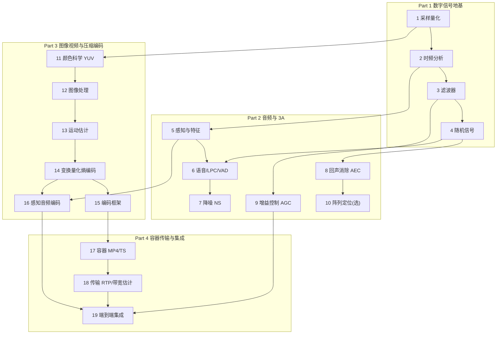

# 音视频开发理论知识路线图

## 总览：四层结构与依赖

- **Part 1（第 1–4 章）**：音频与图像共用的数学地基。产出：WAV 读写器、FFT、卷积/滤波器库、噪声生成器——后面所有章的基础设施，全部来自你的手写代码。
- **Part 2（第 5–10 章）**：音频线主体：感知 → 语音分析（含 LPC）→ 3A 三件套逐个解耦实现 → 阵列选学。
- **Part 3（第 11–16 章）**：图像→视频→压缩编码收口。视频线终点是玩具视频编码器，音频线终点是感知音频编码器（MP3/AAC/Opus 的原理骨架）——两条编码技术路线各自闭环。
- **Part 4（第 17–19 章）**：容器与传输原理（含带宽估计）+ 全链组合（含并发流水线）。全程不调用任何现成编解码/封装/传输库——解剖对象（MP4 文件、RTP 流）是现成的，实现全是你自己的。
- **里程碑**：M1 = 第 6–9 章组合成 3A 链路；M2 = 第 13–16 章组合成双线玩具编码器；M3 = 第 19 章端到端系统。

---

## Part 1 数字信号地基

### 第 1 章 采样与量化

**定位**：一切数字音频/图像的入口，同时产出后续所有章节的 WAV 读写基础设施。

**知识点**：
- 采样定理 $f_s > 2f_{max}$ 与混叠的数学机理；抗混叠滤波为什么必须在采样前
- 量化：位深 B 与量化信噪比 $\mathrm{SNR} \approx 6.02B + 1.76$ dB；均匀/非均匀量化；dither 的作用
- PCM 编码与 WAV 格式：RIFF 容器结构、header 字段逐字节含义
- 常见采样率（8/16/44.1/48 kHz）与音频带宽的对应关系（电话 8k/语音 16k/音乐 44.1k）

**编码实验**：
1. 手写 WAV 读写器（逐字节解析 RIFF/fmt/data 块），读取任意 WAV 并校验 header 字段
2. 合成多音正弦信号 → 不同 $f_s$ 采样 → 输出 WAV 听混叠伪影；对 $f_s/2$ 以上频率成分观察折返现象并画 PGM 频谱热图验证折返位置
3. 同一信号用 16/12/8/4 bit 量化，测各档实际 SNR，与公式值对账；加 dither 对比 4bit 下的听感与谱底

**过关判据**：量化 SNR 实测与 $6.02B+1.76$ 偏差 < 0.5 dB；混叠折返位置与理论值一致。

**材料**：《实时语音处理实践指南》第 1 章；Lyons《Understanding DSP》第 1–2 章（选读）
**依赖**：无

---

### 第 2 章 时频分析（DFT/FFT/STFT）

**定位**：3A 与视频变换编码的共同数学引擎。本章产出你的 FFT 库，第 7/8/10/14/16 章全部复用。

**知识点**：
- DFT 定义与物理含义：$\displaystyle X[k]=\sum_{n=0}^{N-1}x[n]e^{-j2\pi kn/N}$；频率分辨率 $\Delta f=f_s/N$ 与窗长的关系
- 频谱泄漏与窗函数：矩形/Hann/Hamming/Blackman 的旁瓣-主瓣权衡
- FFT 蝶形运算：分治结构、原位计算、$O(N\log N)$ 复杂度来源
- STFT：帧长/帧移/窗的三角关系；**OLA 重构与 COLA 条件** $\sum_m w[n-mH]=\text{const}$；合成-分析（analysis-synthesis）框架——3A 频域算法的基本骨架

**编码实验**：
1. 手写 $O(N^2)$ DFT
2. 手写递归 FFT（偶奇分治）→ 与自己的 DFT 逐点对账；改写为迭代蝶形（选做）
3. STFT + Hann 窗 + 重叠相加 iSTFT → 对任意信号做"变换再逆变换"往返
4. 频谱图：STFT 模取 dB → 输出 PGM 热图，观察鸟鸣/扫频信号的时频轨迹

**过关判据**：FFT vs 自写 DFT 逐点误差 < $10^{-9}$（相对幅度）；STFT→iSTFT 往返相对能量误差 < $10^{-10}$（Hann 窗 50% 重叠满足 COLA）；$N=1024$ 时 FFT 耗时 < DFT 的 1/50（验证复杂度）。

**材料**：《实时语音处理实践指南》第 1 章（STFT/OLA/WOLA 小节）；Lyons 第 4 章（选读）
**依赖**：第 1 章

---

### 第 3 章 滤波器与卷积

**定位**：所有时域处理（AGC 平滑、AEC 滤波器、图像锐化/降噪）的基本操作单元。

**知识点**：
- 卷积 $y[n]=\sum_k h[k]\,x[n-k]$ 的物理含义；线性卷积 vs 圆周卷积；频域快速卷积（复用第 2 章 FFT）
- FIR：线性相位条件、窗函数法设计
- IIR 与 biquad：传递函数、稳定性（极点在单位圆内）、**RBJ cookbook 公式**（lowpass/peaking/shelf——EQ 与音效的标准件）
- 频率响应的几何直觉：零极点图与幅频特性
- 图像视角：2D 卷积核 = 空间滤波器（为第 12 章铺垫）

**编码实验**：
1. 手写直接卷积 → 与 FFT 快速卷积对账（大 N 下验证一致性 + 耗时对比）
2. 窗函数法设计低通 FIR，输出幅频响应为 PGM 曲线（或打印通带/阻带衰减数值）
3. 手写 biquad（RBJ 公式）实现 3 段 EQ，处理音乐 WAV，听 + 频谱对比
4. 设计一个 IIR 低通，扫描截止频率，观察零极点与响应的对应

**过关判据**：快速卷积与直接卷积误差 < $10^{-9}$；biquad 低通的 -3 dB 点实测与设计值偏差 < 2%；FIR 实测线性相位（群延迟恒定）。

**材料**：《实时语音处理实践指南》第 1 章；Lyons 第 5–7 章（选读）
**依赖**：第 2 章

---

### 第 4 章 随机信号与统计滤波

**定位**：3A 的数学语言是统计的（噪声估计、语音概率、维纳增益）。本章补齐统计视角并产出噪声生成器。

**知识点**：
- 随机过程的基本量：均值/方差/自相关/功率谱密度；SNR 的统计定义
- 高斯噪声生成：Box-Muller 变换
- 最优滤波思想：维纳滤波 $H(\omega)=\dfrac{P_s(\omega)}{P_s(\omega)+P_n(\omega)}$——从频域增益推到时域解
- 白噪声/有色噪声；用 AR 模型造有色噪声

**编码实验**：
1. 手写 Box-Muller 高斯噪声发生器，统计检验（均值/方差/直方图输出 PGM 与理论曲线叠对）
2. 合成"干净语音 + 已知功率噪声"数据集（第 6 章起反复用）：信噪比精确可控，封装"按目标 SNR 加噪"工具函数
3. 已知 $P_s, P_n$ 时实现频域维纳滤波降噪，测 SNR 提升；对比 $H=1$（不处理）基线
4. AR(1) 有色噪声生成，观察其功率谱

**过关判据**：噪声统计检验通过（$|\mu|<0.05\sigma/\sqrt N$）；维纳滤波 SNR 提升 ≥ 3 dB（输入 SNR 0 dB 场景）且无先验信息时明确知道为什么做不到。

**材料**：《实时语音处理实践指南》第 1、4 章（维纳滤波小节）
**依赖**：第 3 章

---

## Part 2 音频信号处理与 3A

### 第 5 章 听觉感知与音频特征

**定位**：理解"人耳怎么听"，一切感知编码（MP3/Opus）与响度处理的物理前提。

**知识点**：
- 响度/音调/音色的信号学对应；等响曲线；音调与基频 $f_0$
- 心理声学两大武器：**频率掩蔽**与**时域掩蔽**（感知编码的理论根基，第 16 章正式回收）
- 临界频带与 Bark 尺度；Mel 尺度 $\text{mel}=2595\log_{10}(1+f/700)$
- 电平计量：Peak / RMS / **LUFS（EBU R128 响度归一化）**的差别与适用

**编码实验**：
1. 手写 Mel 滤波器组（三角滤波器组，复用 STFT），对语音算 Mel 频谱，输出 PGM 热图
2. 掩蔽实验：1 kHz 纯音 + 1.1 kHz 弱纯音，调幅度直到听不见弱音，与临界频带理论对账
3. 手写简化版 LUFS（K 加权 + 门限），对若干 WAV 算综合响度，与工具值（若无法对照则与理论推导对账）

**过关判据**：Mel 滤波器组覆盖 0–8 kHz 且中心频率按 Mel 均匀（逐滤波器数值验证）；LUFS 实现对"同素材翻倍增益"给出 +6 LU 的正确响应。

**材料**：《实时语音处理实践指南》第 2 章；任何语音信号处理教材的感知章节（赵力《语音信号处理》选读）
**依赖**：第 2 章

---

### 第 6 章 语音信号分析：LPC 与 VAD（端点检测）

**定位**：3A 里最简单的独立算法 + 语音分析的根技术（LPC），第一个"完整算法闭环"练手。

**知识点**：
- 发音机理与声源-滤波器模型；浊音/清音/静音的信号特征（基频周期、能量谱形状）
- 短时特征：短时能量、过零率、谱平坦度、谱质心
- **线性预测分析（LPC）**：$x[n]\approx\sum_{k=1}^p a_k x[n-k]$；自相关法 + Levinson-Durbin 求解；LPC 包络谱 = 声道传递函数估计（共振峰提取的标准方法）；阶数经验律 ≈ 采样率 kHz 数 + 2–4
- VAD 三代方法：门限 → 统计模型（似然比检验）→ 机器学习（概念了解）
- GMM 与 EM（理解 WebRTC NS 里语音/噪声概率模型的前置）
- LPC 的战略地位：CELP/SILK 等语音编码器的地基（第 16 章语音编码路线的起点）

**编码实验**：
1. 用第 4 章数据集：短时能量 + 过零率双门限 VAD，输出语音段起止点
2. 合成已知语音段/静音段（自己造真值标注），统计 VAD 的查准/查全
3. 进阶：单高斯 → 双高斯 GMM + EM 在能量特征上做似然比 VAD，对比门限版
4. 手写自相关法 LPC（Levinson-Durbin），对浊音帧计算 LPC 包络谱，与 STFT 幅度谱叠加对比，提取共振峰位置

**过关判据**：SNR ≥ 10 dB 时 VAD 起止点误差 ≤ 80 ms（帧级）；SNR 0 dB 时 GMM 版明显优于固定门限版（量化对比报告）；合成元音（已知共振峰真值）的 LPC 谱峰定位误差 ≤ 5%。

**材料**：《实时语音处理实践指南》第 2、3 章（含 GMM/EM 推导与实例）；赵力《语音信号处理》LPC 章节；Rabiner & Schafer（选读）
**依赖**：第 4、5 章

---

### 第 7 章 噪声抑制 NS/ANS

**定位**：3A 之二。从经典方法到 WebRTC 结构的完整阶梯，第一次"对着工业算法结构自实现"。

**知识点**：
- 谱减法：$|\hat S|^\alpha=|Y|^\alpha-\beta|\hat N|^\alpha$；过减因子与音乐噪声的机理与控制
- 维纳滤波降噪与判决引导（decision-directed）先验 SNR 估计 $\hat\xi$
- 噪声估计：最小值跟踪（minimum statistics）思想
- WebRTC NS 的模块分解：噪声估计 → 语音/噪声似然比 → 平滑先验 SNR → 维纳增益 → 增益下限（谱底）

**编码实验**：
1. 谱减法（复用 STFT）：调 $\alpha,\beta$ 看音乐噪声变化，输出处理前后 PGM 频谱热图对照
2. 判决引导维纳滤波：与谱减法同数据对比 SNR 提升 + 残余噪声性质
3. 手写最小值跟踪噪声估计器，在噪声突升场景验证其收敛
4. 按书 4.4 节结构自实现简化版 WebRTC NS（每个子模块对书内伪代码逐段核对）

**过关判据**：输入 SNR 5 dB 白噪声场景：自实现维纳版输出 SNR ≥ 10 dB 且语音段谱损伤可量化（有语音概率保护下增益未把语音压掉 ≥ 1 dB）；噪声突升 10 dB 后噪声估计在 ≤ 1 s 内跟上。

**材料**：《实时语音处理实践指南》第 4 章（谱减/维纳/子空间 + WebRTC NS 逐函数解读 + 深度学习降噪概念）
**依赖**：第 2、4、6 章

---

### 第 8 章 声学回声消除 AEC（8a 原理 + 8b 工程）

**定位**：3A 中数学与工程最难的一块，全书最大的章，拆两段走。

**知识点（8a 自适应滤波原理）**：
- 回声路径模型：$y[n]=\mathbf{h}^T\mathbf{x}[n]$，扬声器→房间→麦克风的线性系统
- LMS 与收敛：$\hat{\mathbf h}\leftarrow\hat{\mathbf h}+\mu e[n]\mathbf{x}[n]$；步长-失调-收敛速度三角
- NLMS：输入功率归一化，$\mu$ 的物理意义
- 频域块自适应 **PBFDAF**（复用第 2 章 FFT）：为什么长路径必须频域做

**知识点（8b AEC 工程系统）**：
- 延迟估计：远端/近端互相关（频域快速互相关）
- 双讲检测（double-talk）与残留回声抑制 NLP：为什么自适应必须被冻结
- WebRTC AEC（旧版三段：延迟估计/自适应滤波/NLP）与 AEC3 的设计代差（概念）
- 工程约束：时钟漂移、非线性扬声器、参考信号断流

**编码实验**：
1. **合成回声数据集**（本章灵魂）：远端语音 + 已知路径 $\mathbf h_{true}$（指数衰减随机抽头）+ 近端语音开关可控 → 每个实验真值在手
2. 8a-1：NLMS 消线性回声，画失调 $\|\hat{\mathbf h}-\mathbf h_{true}\|$ 收敛曲线（PGM），扫 $\mu$ 验证收敛-失调权衡
3. 8a-2：PBFDAF 实现，与 NLMS 对比长路径（512+ 抽头）耗时与收敛
4. 8b-1：频域互相关延迟估计器，在未知延迟下先对齐再消
5. 8b-2：加双讲段，实现简易双讲检测 + 自适应冻结，量化"冻结与否"对 $\hat{\mathbf h}$ 的破坏
6. 8b-3：NLP 简化版（残留抑制），最终测 **ERLE**（回声返回损耗增强）

**过关判据**：单讲场景收敛后 ERLE ≥ 20 dB；延迟估计误差 0（采样点级）；双讲段近端语音损伤 ≤ 1 dB（NLP 生效）；$\mu$ 扫描曲线与理论权衡定性一致。

**材料**：《实时语音处理实践指南》第 5 章（WebRTC AEC + Speex AEC 双实现解读，MATLAB 代码逐段移植）
**依赖**：第 2、3、4 章

---

### 第 9 章 自动增益控制 AGC 与动态范围

**定位**：3A 之三，最偏"控制论"的一章，同时补齐音效链（压缩器/限幅器）——第 19 章混音与集成的最后一块积木。

**知识点**：
- 电平与动态范围：为什么麦克风信号忽大忽小；削波与底噪的两端约束
- 压缩器/限幅器：门限/比率/攻击/释放四参数；软拐点
- AGC 环路结构：目标电平 → 增益估计 → 增益平滑（攻击/释放不对称的原因）→ 限幅保底
- 数字 AGC vs 模拟增益（麦克风 boost）；语音场景特有问题：噪声放大（NS 在前的原因——链路顺序）

**编码实验**：
1. 手写静态压缩器（门限/比率/软拐点），用扫幅正弦测输入-输出曲线，逐点对账
2. 手写 AGC 环路：合成"远讲→近讲"电平跳变 20 dB 的语音，测收敛时间与超调；调攻击/释放看动态伪影
3. AGC + 限幅器串联：大信号输入下输出削波数 = 0
4. 听感验收：处理链在轻声/大声两段录音上响度接近（用第 5 章 LUFS 量化）

**过关判据**：电平跳变后 ≤ 1 s 收敛到目标 ±2 dB；全程无削波（peak < 0 dBFS）；轻/大声两段输出 LUFS 差 ≤ 1 LU。

**材料**：《实时语音处理实践指南》音效部分（压缩/限幅/增益类）；WebRTC AGC 设计思想（概念阅读）
**依赖**：第 3、5 章

---

### 第 10 章 声源定位与麦克风阵列（选学）

**定位**：3A 之外的阵列信号入门，纯仿真零硬件，拓宽视野用。

**知识点**：
- 阵列信号模型：平面波到达时差 TDOA；$c$ 与几何关系
- GCC-PHAT：互相关谱加权为什么能锐化峰
- 波束形成入门：延迟-求和；指向性概念；MVDR 思想（概念）
- 延伸方向（概念注记）：**去混响**（WPE 思想——多通道后期滤波）、**盲源分离**（ICA/独立低秩，会议音频进阶真实需求）

**编码实验**：
1. 仿真双麦阵列（给定角度 → 生成两路带时延信号），手写 GCC-PHAT 估计角度
2. 4 麦延迟-求和波束形成，对目标方向信号增益 vs 干扰方向抑制，输出指向性图（PGM）

**过关判据**：±60° 内定位误差 ≤ 5°；波束形成对目标/抑制方向增益差 ≥ 6 dB。

**材料**：《实时语音处理实践指南》第 6 章
**依赖**：第 2 章（可整体跳过，不影响后续）

---

## Part 3 图像视频与压缩编码

### 第 11 章 颜色科学与像素格式

**定位**：图像线的第 1 章，同时产出 PPM/PGM ↔ YUV 工具（可视化基础设施的正式化）。

**知识点**：
- 人眼三色视觉与 RGB；伽马与 sRGB（为什么 8 bit 够用）
- 亮度与色度分离：$\mathrm{Y}=0.2126R+0.7152G+0.0722B$（BT.709）；YUV/YCbCr 家族
- 色度下采样 4:4:4 / 4:2:2 / 4:2:0 的排列与内存布局（NV12/I420）
- 视频系统的位深与范围（full/limited range 坑）
- 延伸方向（概念注记）：HDR/广色域/BT.2020 与 tone mapping——消费视频真实趋势，原理上延后再学

**编码实验**：
1. 手写 RGB ↔ YUV420 转换（两种 BT 矩阵可切换），往返误差逐像素统计
2. 合成色条图 → 转 YUV420 → 误当 RGB 显示（观察"绿色鬼影"），再正确还原——一次搞懂格式错配
3. 4:2:0 下采样 → 再上采样还原，对高饱和边缘区量化色度损失；输出 PPM 对照图
4. 直方图均衡（手写）对低对比度图像的增强

**过关判据**：RGB→YUV→RGB 往返误差 ≤ 2 LSB（舍入内）；4:2:0 往返后色度边缘 PSNR 数值报告。

**材料**：《音视频开发进阶指南》理论章节（色彩空间部分）
**依赖**：第 1 章（量化概念）

---

### 第 12 章 图像处理基础与质量评价

**定位**：把 Part 1 的滤波器搬到 2D，产出生成测试图像与图像 IO 的全套工具；补上质量评价（PSNR/SSIM）——编码章验收的仪表。

**知识点**：
- 2D 卷积与可分离核；高斯模糊的核构造
- 边缘检测：梯度算子（Sobel）；Canny 的流程思想（非极大值抑制+双门限）
- 插值：最近邻/双线性/双三次的数学与伪影
- 图像噪声与简单去噪（均值/中值滤波的适用差异）
- **质量评价**：PSNR 的定义与盲区；SSIM 结构相似性（亮度/对比度/结构三分量）为什么能区分"PSNR 相同但观感不同"的图像

**编码实验**：
1. PPM/PGM 读写器正式化（若第 11 章已写则在此定版）+ 合成测试图生成器（棋盘/圆/渐变）
2. 手写 2D 卷积 → 利用可分离性优化（行×列两趟），验证等价 + 耗时对比
3. Sobel 边缘检测，输出边缘强度图（PGM）
4. 手写双线性缩放（放大 2×），对斜线观察锯齿差异；与最近邻对比
5. 手写 SSIM（局部均值/方差/协方差滑窗）：构造"亮度平移 vs 结构扭曲"两组图像，验证 PSNR 与 SSIM 的排序分歧

**过关判据**：可分离两趟卷积与直接 2D 卷积误差 < $10^{-9}$；双线性缩放在整数格点上与原图逐点一致；SSIM 对纯亮度/对比度增益的敏感度显著低于 PSNR（构造例数值报告）。

**材料**：《音视频开发进阶指南》理论章节；任何数字图像处理教材对应章节（选读）；SSIM 原始论文（Wang 2004，选读）
**依赖**：第 3、11 章

---

### 第 13 章 运动估计与运动补偿

**定位**：视频编码与"图像"的分水岭——时间冗余的利用，玩具编码器的第一块核心。

**知识点**：
- 时间冗余：视频 = 图像序列 + 小位移；运动矢量与残差的含义
- 块匹配：SAD/SATD 匹配准则；全搜索复杂度 $\mathcal O(N^2 \cdot d^2)$
- 快速搜索：三步法/菱形搜索的思想
- 运动补偿预测：整像素→半像素（插值，复用第 12 章）；遮挡与多假设（概念）

**编码实验**：
1. 合成运动序列：第 12 章测试图 + 已知平移场（可含旋转/缩放做进阶）
2. 全搜索块匹配：恢复已知平移，输出运动矢量场可视化（PPM/PGM）
3. 三步法实现：与全搜索对比恢复精度与耗时（复杂度对账）
4. 半像素精度：对亚像素平移序列，测补偿后残差能量下降

**过关判据**：纯平移序列恢复误差 ≤ 1 像素；三步法在全搜索 1/10 时间内达到同等恢复率（大位移场景）。

**材料**：Richardson《H.264》运动估计章节；高文《数字视频编码技术原理》对应章（二选一主线）
**依赖**：第 12 章

---

### 第 14 章 变换、量化与熵编码

**定位**：空间冗余的利用——编码器三件套的后两件，纯算法零依赖的典范章。

**知识点**：
- 变换的目的：能量集中与去相关；DCT 与 KLT 的关系（为什么 DCT 是"近似最优"）
- 8×8 DCT-II：$\displaystyle F(u,v)=\frac{C(u)C(v)}{4}\sum\sum f(x,y)\cos\frac{(2x+1)u\pi}{16}\cos\frac{(2y+1)v\pi}{16}$
- 量化：量化矩阵与人眼加权；QP 与失真-码率的支配关系
- 熵编码：哈夫曼（构建/编码/解码）、Zigzag 扫描 + 游程（RLC）；算术编码思想（概念）

**编码实验**：
1. 8×8 DCT 手写（直接法即可，$O(N^4)$ 对 8×8 完全够用；FFT 快速版选做）
2. DCT→量化→反量化→IDCT 闭环：扫 QP 画失真曲线；观察高频清零与块效应（输出 PPM 对照）
3. 手写哈夫曼编解码器（优先队列建树 + 码表序列化），对量化后符号流压缩，验证无损往返
4. Zigzag + 游程 + 哈夫曼串联，统计整图压缩比

**过关判据**：IDCT(DCT(x)) 误差 < $10^{-6}$（浮点舍入内）；哈夫曼编解码严格无损（逐符号往返一致）；量化后码流压缩比 > 2:1（正常图像）。

**材料**：Richardson 变换/量化/熵编码章节；高文对应章（二选一）
**依赖**：第 2 章（变换思想）、第 12 章

---

### 第 15 章 视频编码框架与玩具编码器

**定位**：把 13/14 章组装成完整编码器（M2 视频线）；音频编码对照线（ADPCM）在此起步。

**知识点**：
- 编码框架全景：预测（帧内/帧间）→ 变换量化 → 熵编码 的循环结构；I/P/B 帧与 GOP
- **帧内预测**：DC/平面/方向模式的含义——块间空间冗余的第一层利用；环路滤波（去块效应）的动机（概念）
- 码率控制：CBR/VBR/CRF 的含义；QP 决策的简单策略
- H.264 码流结构概览（NAL/切片/宏块——为读规范铺路）；H.265/AV1 的改进方向（概念）
- 音频编码对照线：PCM → **ADPCM**（自适应量化+预测的波形级最小编解码器）→ 感知编码（第 16 章正式展开）
- 工程事实注记：工业编解码还有 GPU/专用硬件路径（NVENC/VideoToolbox/芯片 ISP），原理同构，本路线不涉及

**编码实验（M2 视频线）**：
1. 玩具视频编码器：I 帧 = 帧内预测（DC/水平/垂直三模式逐块择优 + 模式标志位）+ DCT 量化 + 哈夫曼；P 帧 = 块匹配运动补偿（第 13 章）+ 残差 DCT 量化 + 熵编码；解码器完整闭环
2. 简单码率控制：QP 调整使输出码率贴近目标值
3. 编码→解码 PSNR 与码率曲线（扫 QP），输出 RD 曲线数值；用第 12 章 SSIM 复评
4. 手写 ADPCM 编解码器（标准 IMA 风格：自适应步长表 + 预测器），4 bit/样本往返

**过关判据**：CIF 序列闭环解码 PSNR ≥ 30 dB（中等 QP）且运动区域无灾难性漂移（连续 100 帧无误差累积失控）；帧内三模式择优相对纯 DC 模式有可量化收益；ADPCM 往返 SNR ≥ 25 dB（语音）。

**材料**：Richardson 全书总框架章节；《实时语音处理实践指南》音频编解码部分（ADPCM/感知编码背景）
**依赖**：第 13、14 章

---

### 第 16 章 感知音频编码（MDCT 与心理声学模型）

**定位**：音频编码从波形级（ADPCM）到感知级（MP3/AAC/Opus）的跃迁；第 5 章心理声学的正式回收；M2 音频线的终点。只学 ADPCM 会让人以为音频编码是"逼近波形"，而现代音频编码的本质是"逼近听感"。

**知识点**：
- 波形编码 vs 感知编码的分水岭：SNR 不再是目标，**噪声落在掩蔽阈值之下**才是
- **MDCT**：定义、TDAC（时域混叠消除）性质、与 DCT-IV 的关系；为什么音频编码用 50% 重叠 MDCT 而不是 STFT（完美重构 + 临界采样）
- **心理声学模型**：从 STFT 频谱到掩蔽阈值——Bark 频带分组、扩展函数（spread function）、SMR（信号掩蔽比）计算流程
- **比特分配与噪声整形**：按各频带 SMR 分配比特，让量化噪声谱贴着掩蔽阈值走
- 码流语法概念：帧头/边信息/主数据的三层结构（AAC/MP3 帧概览）；立体声技术（MS/强度立体声，概念）
- **技术路线地图**：语音线 LPC→CELP（合成分析+码本，第 6 章 LPC 的去向）→ SILK；通用线 MDCT→AAC→CELT；Opus = 两者混合 + 帧级切换——一个 RFC 看懂为什么
- 里程碑衔接：这是 M2 音频线的终章，也是第 19 章集成链的编码环节升级选项

**编码实验**：
1. 手写 MDCT/IMDCT（50% 重叠），验证 TDAC 完美重构：变换→逆变换往返误差
2. 简化心理声学模型：STFT 频谱 → Bark 频带能量 → 扩展函数卷积 → 各频带掩蔽阈值 → SMR 曲线（输出 PGM：频谱 + 掩蔽阈值叠加图）
3. 玩具感知编码器：MDCT → 按 SMR 分配比特/量化步长（噪声整形）→ 哈夫曼（第 14 章复用）→ 码流；解码闭环
4. 对照实验：同比特率下与第 15 章 ADPCM 对音乐/语音各测——客观 SNR 与主观听感的背离现象（感知编码器 SNR 可能更低但听感无损）

**过关判据**：MDCT→IMDCT 完美重构误差 < $10^{-9}$（相对能量）；同码率（如 64 kbps 等效）下感知编码器的量化噪声谱主体落在掩蔽阈值之下（"噪声 vs 阈值"PGM 图验证）；音乐场景听感显著优于 ADPCM（可辨伪影差异）。

**材料**：Bosi & Goldberg《Introduction to Digital Audio Coding and Standards》（音频编码圣经，核心章选读）；RFC 6716（Opus，一手规范，读路线地图部分）；《实时语音处理实践指南》音频编解码章节
**依赖**：第 2、5、14、15 章

---

## Part 4 容器、传输与系统集成

### 第 17 章 容器格式与 MP4 解剖

**定位**：封装原理。解剖对象用现成 MP4 文件，实现全手写——纯二进制解析，零依赖的极致章。

**知识点**：
- 为什么需要容器：压缩流/时序/索引/多轨的封装问题
- ISO BMFF（MP4）box 树结构：`ftyp`/`moov`/`mdat`；`moov` 内 trak/stbl 层级
- 采样表：stsz/stco/stts——帧定位与随机访问的机制；关键帧索引
- PTS/DTS 与 B 帧：为什么解码顺序 ≠ 显示顺序；reorder 的实现
- 直播线容器对照（概念级）：**MPEG-TS**（188 字节固定包/PAT/PMT/PCR 时钟恢复——广播与 HLS 的底层）与 **FLV**（RTMP 伴生）；定长包 vs 弹性 box 的两种封装哲学
- 点播工程事实：moov 前置（faststart）与流式播放的关系

**编码实验**：
1. 手写 MP4 box 树解析器（逐字节读 box header，递归遍历），输出 box 树（类型/偏移/大小），顶层 + moov 内部全展开
2. 解析 stsz/stco/stts，重建"每帧的偏移/大小/时间戳"索引表；统计 I/P/B 帧大小分布
3. PTS/DTS 重排实验：手写小顶堆按 DTS 送解码、按 PTS 输出（用构造的时序数据验证）
4. （选做）手写 MPEG-TS 包解析器：同步字节搜索、PID 过滤、PCR 提取——与 MP4 解析形成两种封装哲学的体感对照
5. （选做）极简 muxer：把第 15/16 章玩具码流塞进自造的最简 box 结构（自造容器合法即可）

**过关判据**：对 ≥ 3 个不同来源的 MP4，box 树解析与文件十六进制抽查一致；帧索引表能精确定位任意帧（随机读验证）。

**材料**：ISO BMFF 规范概述（ISO/IEC 14496-14 相关社区资料）；现成 MP4 文件（自己录/下载样例）；ISO 13818-1 概览（TS，选读）
**依赖**：第 15、16 章

---

### 第 18 章 流媒体传输原理（RTP、Jitter Buffer 与带宽估计）

**定位**：实时传输的核心算法——打包、抖动、丢包、同步、拥塞。网络实验用本地回环，零硬件零依赖。

**知识点**：
- 实时传输的问题定义：延迟 vs 完整性的取舍；UDP 之上缺什么（时序/丢包/乱序）
- RTP/RTCP：payload 打包、序列号、时间戳（时钟频率 90 kHz 视频惯例）；RTCP 反馈概念（SR/RR/丢包率）
- **Jitter Buffer**：自适应缓冲深度、欠载/溢出处理、乱序重排
- 丢包隐藏（PLC）：静音替代 → 前值保持 → 时域波形类算法的思想
- **带宽估计/拥塞控制**：基于丢包 vs 基于延迟梯度两代思想；WebRTC GCC 结构（到达时间滤波 → trendline 检测 → 状态机 → 速率控制）——RTC 三大传奇算法（3A/NetEQ/GCC）的最后一块
- 音画同步：主时钟选择（为什么以音频为主时钟）；延迟与同步的联合权衡
- 多人架构概念：MCU 混音 vs **SFU 转发**；Simulcast/SVC 的码流分层思想
- 协议谱系概念：RTMP/HTTP-FLV/HLS/LL-HLS/WebTransport 的延迟-生态位对比
- WebRTC 全景概念（ICE/STUN/TURN/DTLS/SRTP/Pacer——概念级，不实现）

**编码实验**：
1. 手写 RTP 打包器/解包器（字节打包 + UDP socket 本地回环）：序列号/时间戳/标志位逐字段自检
2. 模拟网络层（可编排的信道）：随机延迟 0–100 ms + 10% 丢包 + 乱序——一个几十行的延迟/乱序/丢包中间件
3. 手写自适应 jitter buffer：按到达间隔调缓冲深度，统计欠载率与端到端延迟的权衡曲线
4. PLC 链条：静音→前值保持→简单波形外推，三档在丢包 10% 下的听感与客观指标对比
5. **GCC 简化版**：在模拟信道上合成"延迟梯度缓慢抬升 → 拥塞 → 丢包 → 恢复"剧本，实现 trendline 检测 + 降速/升速状态机；输出"发送速率 vs 时间"曲线，与丢包时刻对齐分析
6. 音画同步器：音频主时钟 + 视频帧对齐（提前/迟到决策逻辑），构造双轨数据验证

**过关判据**：10% 丢包 + 100 ms 抖动下：jitter buffer 欠载率 < 1%，端到端延迟收敛并稳定；GCC 简化版在拥塞 onset（延迟梯度抬头）时先于丢包发生降速（领先 ≥ 500 ms 的剧本设定下），且稳态利用率 ≥ 80% 不震荡；PLC 三档恢复质量可量化排序；音画偏移稳定在 < 1 视频帧。

**材料**：RFC 3550（RTP）核心章节；draft-ietf-rmcat-gcc（GCC 一手材料）；WebRTC 官方架构文档（概念）；《音视频开发进阶指南》流媒体章节
**依赖**：第 17 章

---

### 第 19 章 端到端集成（M3 毕业项目）

**定位**：全部手写积木的组合验收。没有 FFmpeg/Opus/libwebrtc——每个环节都是你前面章节的产物。组合层新增的工程知识：并发结构与多时钟域。

**知识点（组合层新增）**：
- **并发流水线**：采集线程 → 处理线程 → 发送线程的生产者-消费者结构；有界队列（环形缓冲）与**背压**；无界队列 = 延迟无上界（反例教学）
- **多时钟域**：采集时钟（文件模拟节拍）、网络节拍、播放时钟三个时钟的漂移与补偿；为什么工业方案播放端还要微重采样（概念，复用 jitter buffer 思想）
- 管线思维：采集→处理→编码→封装→传输→缓冲→解码→渲染的实时预算分配（每环节 ms 预算表）
- 处理链顺序的工程依据：3A 为什么是 AEC→NS→AGC（每一步的输出是下一步的输入假设）
- **多人混音**（概念+小实验）：多路电平对齐 → 求和 → 软限幅（复用第 9 章）；混音（MCU）与 SFU 转发的架构取舍
- 质量归因方法论：端到端出问题时如何二分定位（中间探针/逐级 bypass）

**编码实验（M3）**：
1. 采集模拟器：WAV/图像序列按帧读出 + 定时节拍发送——等价模拟实时流，零声卡/摄像头依赖
2. **双线程流水线**：采集线程 → 有界环形队列 → 处理链线程 → 输出线程；对照无界队列版，注入"处理慢一拍"，观察背压 vs 延迟爆炸
3. 全链组装：音频 VAD（6）→ AEC（8，合成参考）→ NS（7）→ AGC（9）→ ADPCM（15）或感知编码器（16）→ 自造 RTP（18）→ jitter buffer + PLC（18）→ 解码 → WAV 回放；视频线：合成序列 → 玩具编码器（15）→ 打包（17 思想）→ 传输 → 解码 → PPM 序列回放
4. 音画同步器接入（18 的产物），主时钟驱动；可选：两路音频混音（电平对齐 + 软限幅）
5. 逐级探针：每个环节中间落盘（WAV/PPM），做二分定位演练——人为注入一个 bug，用探针定位它

**过关判据**：全链往返输出主观可懂（语音可辨/图像可认）；音频链 ERLE ≥ 15 dB 且 AGC 收敛指标保持（集成后无退化）；有界队列版延迟有上界且满载丢帧策略生效（无界版对照延迟持续增长）；端到端延迟有实测数字；注入 bug 在 30 分钟内用探针定位成功。

**依赖**：第 6–9、15–18 章

---

## 里程碑组合项目汇总

| 里程碑 | 组合章节 | 产出 | 验收 |
|--------|---------|------|------|
| M1 音频 3A 链 | 6→8→7→9 | 完整语音前端处理链 | 各级指标维持 + 链序依据说得清 |
| M2 双线编码器 | 13→14→15→16 | 视频玩具编码器 + ADPCM + 感知音频编码器 | 视频 PSNR ≥ 30 dB 闭环 + RD 曲线；音频量化噪声入掩蔽阈值 |
| M3 端到端系统 | M1+M2+17/18 | 实时传输最小系统（全手写 + 双线程流水线） | 延迟/同步/探针定位/背压四达标 |

## 路径选择

| 路径 | 章节组合 |
|------|---------|
| 急用 3A | 1→9（跳 10） |
| 急用视频 | 1→4、11→15 |
| 音频编码方向 | 1→5、14→16 |
| 全量系统 | 1→19 |
| 阵列/前端进阶 | 全量 + 第 10 章深化（去混响/BSS 方向） |

## 材料映射表

| 材料 | 覆盖章节 | 用法 |
|------|---------|------|
| 《实时语音处理实践指南》（葛世超 等） | 1–10 主线、15–16 背景 | 主干教材，书内 MATLAB 逻辑逐段移植为自己的实现 |
| Lyons《Understanding DSP》 | 1–4 深化 | 选读，直觉补充 |
| 赵力《语音信号处理》 | 5–7 背景深化（LPC 等） | 选读 |
| Richardson《H.264 Advanced Video Compression》 | 13–15 | 视频线主干教材 |
| 高文《数字视频编码技术原理》 | 13–15 中文替代 | 与 Richardson 二选一 |
| Bosi & Goldberg《Intro to Digital Audio Coding and Standards》 | 16 | 音频编码圣经，核心章选读 |
| RFC 6716（Opus） | 16 路线地图 | 一手规范 |
| RFC 3550（RTP） | 18 | 一手规范 |
| draft-ietf-rmcat-gcc | 18 | 带宽估计算法一手材料 |
| 《音视频开发进阶指南》（展晓凯 等） | 11、15、18 概览 | 地图用法，只读理论章节 |
| ISO BMFF / ISO 13818-1 社区资料 | 17 | MP4/TS 结构参考 + 现成文件解剖 |
